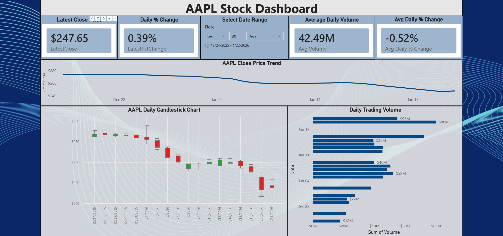
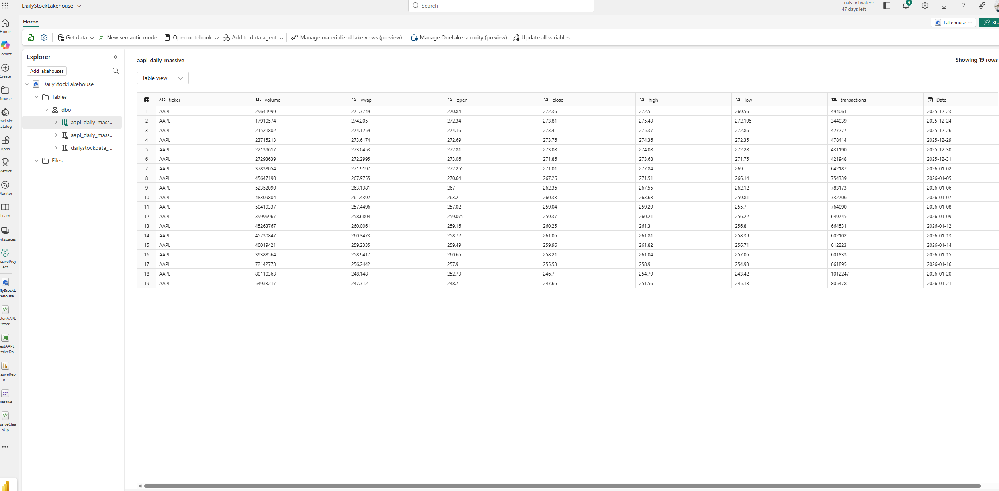
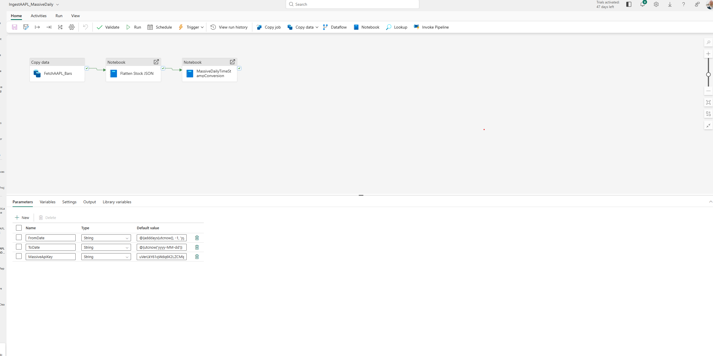

# Massive.com AAPL Stock Pipeline & Power BI Dashboard

Built with Microsoft Fabric (trial capacity) to create an end-to-end, automated data pipeline and interactive dashboard for AAPL daily stock bars from Massive.com API.

## Features
- Automated daily ingestion, processing, and appending of 30-day stock data batches
- Growing historical Delta table with deduplication on date
- Interactive Power BI dashboard showing candlestick trends, latest price, daily % change, volume, and date slicers

## Automation
The entire workflow runs **fully automated on a nonthly schedule** in Microsoft Fabric:

1. **Scheduled Trigger**  
   A recurring Monthly trigger (set in the pipeline editor) starts the process automatically every day.

2. **Data Ingestion**  
   The **Copy data** activity fetches the latest 30-day batch of AAPL daily bars directly from the Massive.com API (JSON format) and saves it as a raw file in the lakehouse Files section.

3. **Transformation & Cleaning**  
   - **Notebook 1 (Flatten Stock JSON)** automatically reads the raw JSON, explodes the nested "results" array into daily rows, casts data types, derives the Date column, and saves the flattened table (`DailyStockData_Clean`).
   - **Notebook 2 (MassiveCleanUp)** loads the flattened table, renames columns to clean names, deduplicates on Date (removing any overlapping API pulls), drops unnecessary columns (e.g., timestamp), and **appends** only new unique rows to the final growing table (`aapl_daily_massive`).

4. **Dashboard Refresh**  
   The Power BI report connects directly to the lakehouse table and can be refreshed manually (Refresh button) or automatically via scheduled refresh in Power BI Service (once published).

This hands-free automation ensures the dashboard always reflects the latest available data with minimal intervention, while the append + dedup logic keeps a clean, growing historical dataset over time.

## Screenshots
  
  

## Files
- MassiveReport1.pbix  
- MassiveReport1.pdf

## Tools Used
- **Microsoft Fabric**: Pipeline (scheduled), Lakehouse (storage), Notebooks (PySpark transformation)
- **Power BI** (web): Candlestick chart, line chart, bar chart, KPI cards, date slicer

Portfolio project by Sean Dunleavy
